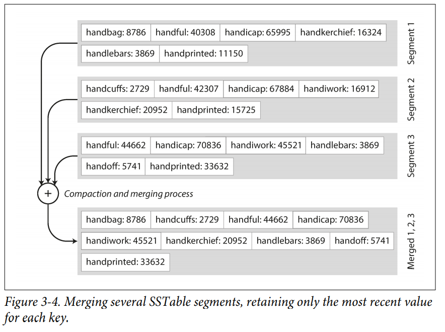
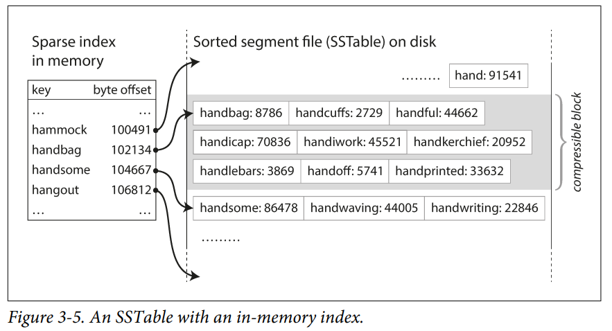
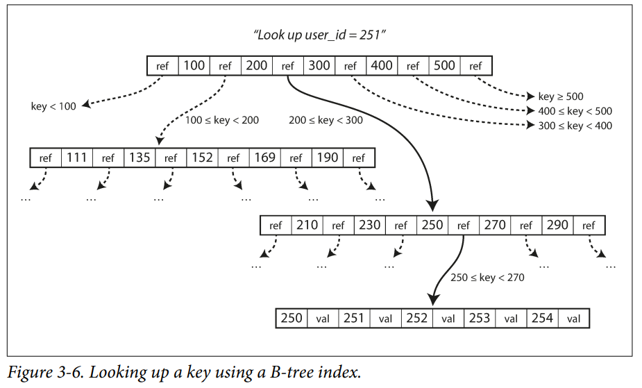

- [1장. 신뢰할 수 있고 확장 가능하며 유지보수하기 쉬운 애플리케이션](#1장-신뢰할-수-있고-확장-가능하며-유지보수하기-쉬운-애플리케이션)
    - [신뢰성](#신뢰성)
    - [확장성](#확장성)
    - [유지보수성](#유지보수성)
- [2장. 데이터 모델과 질의 언어](#2장-데이터-모델과-질의-언어)
    - [관계형 모델](#관계형-모델)
    - [문서 모델](#문서-모델)
    - [그래프 모델](#그래프-모델)
- [3장. 저장소와 검색](#3장-저장소와-검색)
    - [데이터베이스를 강력하게 만드는 데이터 구조](#데이터베이스를-강력하게-만드는-데이터-구조)
        - [해시색인](#해시색인)
        - [SS테이블과 LSM트리](#ss테이블과-lsm트리)
        - [B트리](#b트리)
        - [B트리 LSM트리 비교](#b트리-lms트리-비교)
        - [기타 색인 구조](#기타-색인-구조)

---

### 1장. 신뢰할 수 있고 확장 가능하며 유지보수하기 쉬운 애플리케이션

오늘날 많은 애플리케이션은 데이터 중심(data-intensive)적이다.

- CPU 성능은 더이상 애플리케이션을 제한하는 요소가 아님
- 데이터의 양, 데이터의 복잡도, 데이터 변화 속도가 훨씬 중요함

단일 도구로만 데이터 저장과 처리 모두를 만족시키기 어려우며 다양한 도구를 조합하여 사용해야 한다. 따라서 개발자는 애플리케이션 개발 뿐 아니라 다양한 데이터 시스템 도구를 잘 이해하고 사용해야한다. 대부분의
소프트웨어 시스템에서 중요하게 여기는 세가지 관심사는 다음과 같다.

- 신뢰성
    - 하드웨어나 소프트웨어 결함. 심지어 인적 오류(human error) 같은 역경에 직면하더라도 시스템은 지속적으로 올바르게 동작해야함
- 확장성
    - 시스템의 데이터 양, 트래픽 양, 복잡도가 증가하면서 이를 처리할 수 있는 적절한 방법이 있어야함
- 유지보수성
    - 시간이 지남에 따라 여러 다양한 사람들이 시스템 상에서 작업할 것이기 때문에 모든 사용자가 시스템 상에서 생산적으로 작업할 수 있게 해야함

#### 신뢰성

결함(fault)이 발생해도 시스템은 올바르게 동작해야 한다.

- 결함(fault)
    - 잘못될 수 있는 그 무언가 (사영을 벗어난 시스템의 한 구성 요소) 이며, 결함 확률을 0으로 만들수는 없음
    - 결함을 예측하고 대처할 수 있는 시스템을 내결함성(fault-tolerant) 또는 탄력성(resilient) 을 지녔다고 함
    - 사용자에서 필요한 서비스를 제공하지 못하고 시스템 전체가 멈추는 것을 의미하는 장애(failure)와는 다름
    - 카오스 몽키 프레임워크 (무작위로 시스템의 개별 프로세스 종료시키는 등 고의적으로 결함을 발생시켜 시스템을 테스트) 활용 가능
    - 하드웨어 결함
        - 하드웨어 구성 요소에 중복을 추가하는 방법으로 극복 (예: RAID 디스크, 이중 전원 등)
    - 소프트웨어 결함
        - 예상하기 어렵고, 신속한 해결이 어려움
        - 시스템의 가정과 상호작용에 대해 주의깊게 생각, 충분한 테스트, 프로세스 격리, 모니터링, 로그 분석 등이 필요함
    - 설정 오류 등 인적 오류에 의한 결함 발생 가능성을 고려해야 함

#### 확장성

부하가 증가해도 시스템은 좋은 성능을 유지해야 한다.

- 부하 기술하기
    - 부하 매개변수라 부르는 몇 개의 지표로 표현 가능하며 시스템 설계에 따라 달라짐
        - 트위터의 fan-out 설계는 사용자당 팔로워의 분포가 핵심 부하 매개변수임
    - 소수의 사용자에 의한 극단적인 경우가 큰 부하를 발생시키도 함
        - 트위터의 fan-out 설계는 팔로워가 수천만명이 되는 일부 사용자에게는 큰 도전 과제가 됨
- 성능 기술하기
    - 처리량(throughput)은 단위 시간당 처리할 수 있는 레코드의 갯수 (일괄 처리 시스템에서 중요함)
    - 응답 시간(response time)은 클라이언트가 요청을 보내고 응답을 받을 때까지의 시간 (온라인 시스템에서 중요함)
        - 동일한 요청도 매번 응답 시간이 다를 수 있으므로, 응답 시간은 분포로 생각 해야함
        - 산술 평균(mean)은 별로 의미가 없고, 백분위(percentile)를 사용하는 것이 좋음
            - p999(99.9%) 같은 상위 백분위가 특히 중요함. 이들 사용자는 가장 많은 데이터를 가지고 있는 중요 고객
            - 그러나 모든 사용자에 대한 최적화는 현실적으로 불가능하므로 어느정도 타협이 필요함 (아마존에서는 99.99분위에 대한 최적화는 하지 않음)
- 부하에 대한 접근 방식
    - 좀 더 좋은 장비를 사용하는 scale-up 방식
        - 돈으로 해결할 수 있는 가장 쉬운 접근법
        - 그러나 scale-up 에는 물리적 한계가 있고, 시스템 성능 증가도 선형적이지 않음
    - 가성비가 좋은 다수의 장비를 사용하는 scale-out 방식
        - 상태가 있는 시스템을 다수의 장비에 분산하는 일은 많은 복잡도가 발생 함
        - 주요 동작이 무엇이고, 평소에 잘 하지 않는 동작이 무엇인가에 대한 정의가 필요함 (=부하 매개변수)
        - 위 가정이 잘못되면 시스템은 제대로 동작하지 않게 됨

#### 유지보수성

시스템에서 작업하는 엔지니어와 운영 팀의 삶을 개선한다.

- 운용성: 운영하기 쉬워야 함
    - 반복되는 작업을 자동화하고 운영팀이 고부가가치 활동에 집중할 수 있게 해야함
- 단순성: 시스템 복잡도를 최대한 제거해 이해하기 쉬워야함
    - 추상화를 통해 시스템의 복잡도를 숨김
    - 그러나 좋은 추상화를 위한 방법은 명확하지 않으며, 경험적으로 익혀야 함
- 발정성: 시스템을 쉽게 변경할 수 있게 해야함
    - 시스템 요구사항은 끊임없이 변화하기 때문

### 2장. 데이터 모델과 질의 언어

데이터 모델은 소프트웨어 개발에서 가장 중요한 부분이다.

- 소프트웨어가 어떻게 작성됐는지를 설명함
- 소프트웨어가 문제를 어떻게 생각해야 하는 하는지에 대해 영향일 끼침

아래 세 가지 데이터 모델이 가장 널리 쓰인다. 각 데이터 모델에서 어떤 연산은 빠르지만 또 어떤 연산은 매우 느리다. 따라서 각자 목적에 맞게 잘 사용해야 한다.

- 관계형 모델
- 문서 모델
- 그래프 모델

#### 관계형 모델

Row 집합인 테이블들의 관계로 구성된다. (a.k.a RDBMS)

- 모든 데이터는 정해진 스키마를 따름
- 온라인 트랜잭션 처리, 일괄처리 목적으로 가장 널리 사용됨
- 중복 데이터를 제거하고, 데이터의 효과적인 관리를 위해 정규화할 수 있음
- 일대다, 다대일 관계를 잘 표현함
- 최신 버전의 RDBMS에서는 데이터를 문서 모델처럼 다룰 수 있도록 기능을 지원하기도 함 (JSON 컬럼 타입 지원)
- 상속, 다형성 같은 객체지향에서 중요한 특징을 RDBMS 모델로 표현하기 어려움
    - 다양한 ORM 도구를 이용할 수 있으나 근본적인 문제의 해결은 아님

데이터 질의를 위해 SQL 이라는 선언형 질의어를 사용한다.

#### 문서 모델

데이터가 문서 자체에 포함되 있으며, 하나의 문서가 다른 문서와 관계를 거의 가지지 않을 경우 유리하다.

- 정해진 스키마가 없음
    - 변화하는 요구사항에 맞춰 쉽게 변경 가능
    - 데이터를 읽을 경우 암묵적인 스키마를 이용해 데이터를 해석해야 함
- 데이터가 모두 한 문서 내에 있기 때문에 성능이 좋음 (JOIN 불필요)
    - 데이터를 읽거나 쓸때 전체 문서를 처리해야 함으로 문서의 크기를 작게 유지해야 좋음
- JSON 포맷으로 표현하기 좋음
- 애플리케이션이 발전하며 데이터가 상호 연결되는 경향이 있기 때문에, 점진적으로 어려움을 겪을 수 있음
    - 보통 JOIN 질의 처리 지원이 약하기 때문에 애플리케이션에서 코드로 구현해야 함

MapReduce 등으로 데이터 질의를 표현할 수 있다. SQL을 MapRecude 연산으로 처리해주는 도구들도 있다.

#### 그래프 모델

다대다 관계가 매우 일반적인 데이터를 처리하는데 좋다. 정점(vertex)과 간선(edge)이라는 두 유형의 데이터로 표현된다.

- 정점은 다른 정점과 간선으로 연결됨
- 정점이 주어지면 정점으로 유입되거나 유출되는 간선을 효율적으로 찾을 수 있고 그래프 순회가 가능함
- 정해진 스키마가 없음 (문서 모델과 동일)
    - 변화하는 요구사항에 맞춰 쉽게 변경 가능
    - 데이터를 읽을 경우 암묵적인 스키마를 이용해 데이터를 해석해야 함

데이터 질의를 위해 사이퍼(Cypher) 이라는 선언형 질의어를 사용한다.

### 3장. 저장소와 검색

데이터베이스가 데이터를 어떻게 저장하고 검색을 하는지 근본적인 내용을 확인한다. 고수준에서 데이터베이스 엔진은 트랜잭션 처리(OLTP)와 분석 처리(OLAP)라는 큰 두가지 범주로 나뉜다.

- OLTP 시스템
    - 다수의 사용자로부터 대량의 요청을 받을수 있음
    - 큰 부하를 다루기 위해 애플리케이션은 보통 작은 수의 레코드 만을 다룸
    - 효율적인 데이터 질의 처리를 위해 색인을 사용함
    - 보통 디스크 탐색이 병목지점임
    - 갱신불가 저장소 엔진 (log-structured)
        - LSM 트리 기반 HBase, 카산드라 등
        - 세그먼트 파일에 추가만 가능함, 컴팩션 과정이서 불필요한 데이터 삭제
    - 갱신가능 저장소 엔진 (page-oriented)
        - 전통전인 RDBMS 시스템
- OLAP 시스템
    - 비즈니스 분석가가 주로 사용
    - OLTP 시스템보다 훨씬 적은 수의 질의를 다룸
    - 그러나 질의 자체는 매우 복잡하고 대량의 레코드 스캔을 필요로함
    - 보통 디스크 대역폭이 병목지점임
    - 이런 병목지점 극복을 위해 컬럼 지향 저장소 엔진들이 나타남

#### 데이터베이스를 강력하게 만드는 데이터 구조

데이터베이스에서 특정 키의 값을 효유적으로 찾기 위해서는 색인(index)이 필요하다. 색인이란 일종의 부가적인 메타데이터이며 데이터의 위치를 찾는데 도움을 준다.

색인은 아래 두 가지 중요한 트레이드 오프 속성이 있다.

- 색인의 추가/삭제는 원본 데이터의 내용에는 영향을 끼치지 않지만, 데이터 질의 성능에 영향을 줌
- 색인 구조의 유지보수는 데이터 쓰기에 추가적인 오버헤드를 발생시킴

즉, 색인을 잘 만들어두면 데이터 조회 성능이 좋아진다. 그러나 모든 색인은 데이터 쓰기 성능을 떨어트린다. 따라서 애플리케이션 개발자는 애플리케이션의 전형적인 질의 패턴을 활용해 색인을 선택할 수 있어야 한다.

#### 해시색인

매우 일반적인고 간단항 색인 방법이다. 프로그래밍 언어의 Dictionary-Type(Java의 HashMap) 과 매우 유사하다.

추가전용파일 기반 데이터 저장소에 응용한다고 가정해보자.

- 해시 맵의 Key는 레코드의 키를 저장함
- 해시 맵의 Value는 레코드의 위치를 저장함 (파일 offset)
- 새로운 Key-Value를 추가할때마다 해시 맵 갱신 필요
- 데이터 조회시 해시 맵에서 레코드의 offset을 찾아서 파일에서 빠르게 찾을수 있음
- **데이터 저장 순서대로 파일에 기록되며(정렬X) 가장 나중의 값이 이전 값보다 우선함**

파일에 데이터가 추가되기만 한다면 결국 DISK 공간이 부족해질 것이므로, 파일을 특정 크기의 세그먼트(segment)로 나누어서 관리한다.

- 백그라운드 쓰레드가 지속적으로 세그먼트 파일들을 컴팩션(compaction)하고 병합함
    - 병합 결과 새로운 세그먼트 파일이 만들어짐 (세그먼트 파일은 수정불가이기 때문)
    - 이 과정에서 중복된 오래된 레코드를 버리고 최신의 레코드만 유지함
- 각 세그먼트 파일을 담당하는 해시 맵이 존재함
- 데이터 조회시 가장 최신의 세그먼트 파일 해시 맵을 확인하고 없으면 두번째 최신 세그먼트 파일을 찾음
    - 병합 과정을 통해 세그먼트 파일 수를 적은 수로 유지할수 있다면 확인해야 하는 해시 맵의 수가 적으므로 조회 성능이 크게 나빠지지 않음
- 제약사항
    - 데이터가 너무 많아 해시 맵을 메모리에 유지할 수 없다면 성능이 크게 나빠짐
    - **범위 질의에 효율적이지 않음**

#### SS테이블과 LSM트리

앞서 살펴본 세그먼트 파일을 Key로 정렬한다. 이것을 SS테이블(Sorted String Table) 이라 한다. 백그라운드에서 연쇄적으로 SS테이블을 지속적으로 병합하는 것은 LSM(Log-Structured
Merge-Tree)의 기본 개념이다.

- 데이터 저장시 메모리 기반 균형 트리(AVL, Red-Black-Tree 등)에 추가하면 정렬된 상태를 유지할수 있음 (멤테이블)
    - 데이터베이스 장애시 메모리 데이터를 유실할수 있으므로, 로그를 디스크에 기록 (WAL 로그)
    - WAL 로그는 정렬될 필요는 없으며, SS테이블 파일로 저장되면 버릴수 있음
- 멤테이블이 일정 크기보다 커지면 디스크에 기록함 (SS테이블)
    - 데이터 구조가 이미 정렬된 상태를 유지하고 있기 때문에 효율적으로 처리됨
    - 해당 파일이 가장 최신의 세그먼트 파일이 됨
- 데이터 조회시 멤테이블을 먼저 확인하고 없으면 최신 세그먼트 파일을 찾음
- 백르그라운드 쓰레드가 지속적으로 세그먼트 파일들을 컴팩션하고 병합함

장점은 아래와 같다.

- 높은 쓰기 처리량을 보장
- 병합정렬(merge-sort) 알고리즘으로 세그먼트 파일 병합을 효율적으로 처리할 수 있음
    - 병합 결과로 만들어진 새로운 세그먼트 파일도 정렬돼 있음
- 정렬된 데이터 구조를 이용해 범위 질의를 효율적으로 실행할수 있음
- 모든 키를 담고 있는 메모리 해시 맵을 유지할 필요가 없음
    - 다만 일부 키에 대한 희소색인(sparse index)이 필요함

물론 성능 최적화의 여지도 있다.

- 데이터베이스에 존재하지 않는 Key로 조회시 느릴수 있음
    - 멤테이블을 확인한 후 모든 세그먼트 파일을 모두 확인해야하기 때문
    - 블룸필터(Bloom Filter)를 이용해 최적화 가능
        - 블룸 필터에 의해 어떤 원소가 집합에 속한다고 판단된 경우 실제로는 원소가 집합에 속하지 않는 긍정 오류가 발생하는 것이 가능하지만, 반대로 원소가 집합에 속하지 않는 것으로 판단되었는데 실제로는
          원소가 집합에 속하는 부정 오류는 절대로 발생하지 않음
        - 즉, 블룸필터를 통해 Key가 존재하지 않음을 빠르게 확인 가능
    - 다양한 SS테이블 병합 전략
        - 크기계층(size-tiered), 레벨 컴팩션(leveled compaction) 전략이 있음

#### B트리

가장 일빈적인 유형의 색인 구조이이다. (보다 정확하게는 B+트리이다. B트리는 특정 Key 값이 전체에서 단 1개만 존재하지만, B+트리에서는 Leaf 노드와 해당 Leaf 노드의 부모 노드에 Key값이 2개
존재한다.)

- 보통 4KB 고정 페이지로 나누고, 하나의 페이지에 읽기 또는 쓰기를 함
- 하나의 페이지에서 다른 페이지를 참조하는 수를 분기 계수(branching factor)라 함 (페이지의 Key의 갯수 +1)
- N개의 Key를 갖는 B+트리의 깊이는 O(logN)이기 때문에 검색을 위해 B+트리 참조를 많이 따라가지 않음 (보통 3~4단계)
- 또한, B+트리는 정렬 상태를 유지하기 때문에 범위 질의를 효율적으로 처리함

LSM트리와의 큰 차이는 LMS트리에서는 데이터 갱신이 허용되지 않지만, B+트리에서는 데이터 갱신이 허용된다. 따라서 신뢰할 수 있는 B+트리를 만들기 위해 아래와 같은 고려사항이 있다.

- B+트리의 데이터 삽입은 종종 여러 페이지에서의 작업을 필요로함 (B+트리 균형 유지를 위해 기존 페이지를 분할하고, 두 페이지의 참조를 갱신해야함)
    - 위 과정에서 일부만 성공하고 데이터베이스에 장애가 생긴다면 색인 구조가 망가질수 있음
    - 예로 고아 페이지(orphan page)는 어떤 페이지와도 부모관계가 없는 페이지를 말함
    - 따라서, B+트리 변경사항을 WAL 로그에 먼저 기록해야 함
- 다중 쓰레드에서 동일 페이지에 동시 갱신 작업을 수행할 경우 latch 같은 경량 동기화 장치를 활용해 보호가 필요함

#### B트리 LSM트리 비교

- B트리 특징
    - 읽기에 최적화됨
    - 강력한 트랜잭션 시맨티 제공에 유리함
        - key가 색인의 한곳에 정확히 존재하기 때문
        - LMS트리의 경우 다수의 세그먼트 파일에 Key가 존재할수 있음
    - 쓰기 동작은 최소 2번(WAL, 페이지)의 디스크 쓰기가 필요하며, 경우에 따라 트리의 균형을 맞추기 위해 다수의 페이지 연산이 발생함
    - 오랫동안 다양한 최적화 기법들이 개발되고 적용됨 (안정적)
- LSM트리 특징
    - 쓰기에 최적화됨 (컴팩션 단계에 있는 여러 데이터 구조와 SS테이블을 확인해야 하기 때문에 읽기는 상대적으로 느림)
    - 쓰기 증폭 (한번의 쓰기 동작이 디스크에 여러번의 쓰기를 유발하는 것)이 상대적으로 낮음
    - 압축률이 좋고, 파편화가 적음 (컴팩션과 병합 과정을 통해 주기적으로 SS테이블을 최적화함)
    - 진행중인 컴팩션이 읽기와 쓰기 성능에 영향을 주고 예측하기가 쉽지 않음 (상위 백분위 질의 응답 시간이 길어지는 현상이 있을수 있음)
    - 시간이 지나고 점점 더 많은 데이터를 처리할 수록 디스크 대역폭을 많이 필요로함 (WAL, 멤테이블 디스크 Flush, 세그먼트 파일 병합 등)
    - 컴팩션 최적화가 어렵기 때문에 주의깊은 모니터링 필요

#### 기타 색인 구조

기본키(PK) 색인 외에 효율적인 JOIN 목적 등으로 보조 색인(secondary index)를 만들 수 있다.

- 기본키 색인에서 Key 값은 고유함
- 보조 색인에서 Key는 중복될수 있음

색익에서 실제 데이터로의 참조를 따라가 데이터를 읽어와야 하는 경우 읽기 성능에 불이익이 많다. 아래는 이런 읽기 성능 불이익을 최적화하는 방법이다.

- 클러스터드 색인(clustered index): 색인 안에 바로 데이터를 저장함
- 커버링 색인(covering index): 색인 안에 테이블 컬럼의 일부를 저장함
    - index with included column 이라고도 함
    - 색인 안의 일부 컬럼 데이터로 질의 응답이 가능한 경우 "커버"했다라고 함

색인에 2개 이상의 Key가 포함되는 경우 결합 색인(concatednated index)이라고 한다.

- 예를 들어 (성, 이름)을 Key로 질의 하는 경우 유용하게 사용할 수 있음
- 결합 색인을 구성하는 첫 번째 컬럼이 조건절에 쓰여야 의미가 있음

메모리의 가격이 점점 내려가며 전체 데이터를 메모리에 보관하는 In-Memory 데이터베이스가 존재한다. 일반적으로 메모리 스토리지를 캐시 용도로만 사용하고, 장비 재시작시 데이터 손실을 허용하는 용도로 많이
사용된다.

- 안티 캐싱(anti-caching) 방식을 이용하면 가용한 메모리보다 더 큰 데이터셋을 처리할 수 있음
    - LRU 알고리즘을 통해 일부 데이터를 메모리에서 디스크로 Flush 함
    - 나중에 데이터가 다시 필요할때 디스크에서 메모리로 적재
- 디스크 기반 색인으로 구현하기 어려운 데이터 모델을 제공하기도 함
    - 레디스의 우선순위 queue, set 등
    - 구현이 비교적 쉬움

마지막으로 철자가 틀린 단어와 같이 유사한 키에 대해서 검색을 위한 퍼지(fuzzy) 색인이 있다.