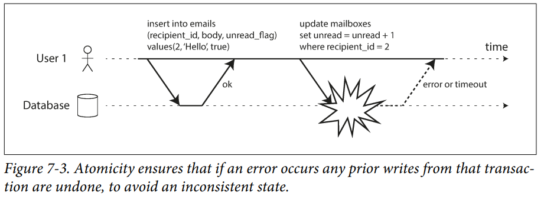
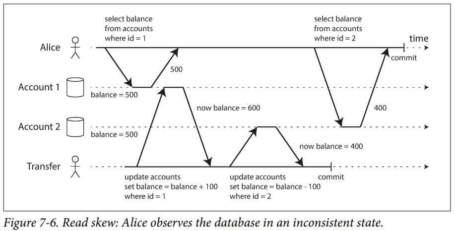
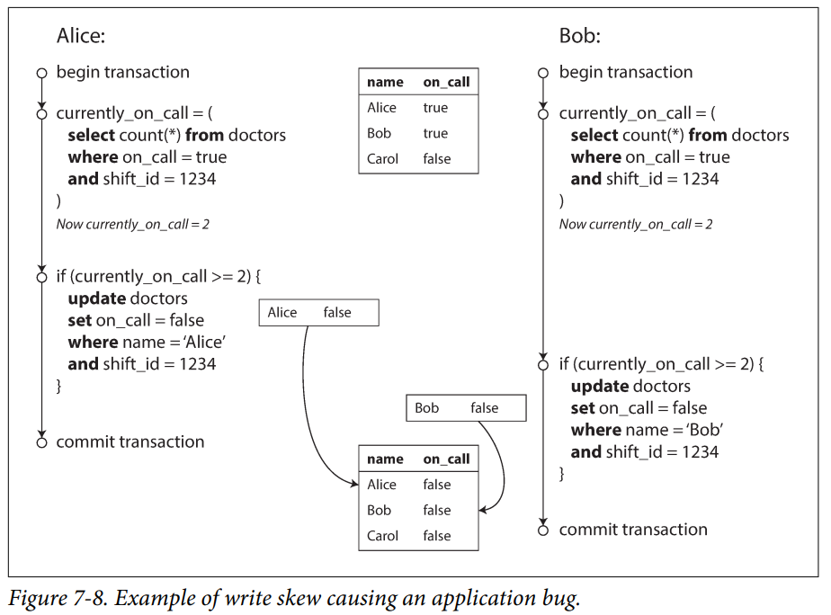

- [1장. 신뢰할 수 있고 확장 가능하며 유지보수하기 쉬운 애플리케이션](#1장-신뢰할-수-있고-확장-가능하며-유지보수하기-쉬운-애플리케이션)
    - [신뢰성](#신뢰성)
    - [확장성](#확장성)
    - [유지보수성](#유지보수성)
- [2장. 데이터 모델과 질의 언어](#2장-데이터-모델과-질의-언어)
    - [관계형 모델](#관계형-모델)
    - [문서 모델](#문서-모델)
    - [그래프 모델](#그래프-모델)
- [3장. 저장소와 검색](#3장-저장소와-검색)
    - [데이터베이스를 강력하게 만드는 데이터 구조](#데이터베이스를-강력하게-만드는-데이터-구조)
        - [해시색인](#해시색인)
        - [SS테이블과 LSM트리](#ss테이블과-lsm트리)
        - [B트리](#b트리)
        - [B트리 LSM트리 비교](#b트리-lms트리-비교)
        - [기타 색인 구조](#기타-색인-구조)
- [4장. 부호화와 발전](#4장-부호화와-발전)
- [5장. 복제](#5장-복제)
- [6장. 파티셔닝](#6장-파티셔닝)
    - [Key-Value 데이터 파티셔닝](#Key-Value-데이터-파티셔닝)
        - [Key 범위 기준 파티셔닝](#Key-범위-기준-파티셔닝)
        - [Key 해시값 기준 파티셔닝](#Key-해시값-기준-파티셔닝)
    - [파티셔닝과 보조색인](#파티셔닝과-보조색인)
        - [문서 기준 보조 색인 파티셔닝](#문서-기준-보조-색인-파티셔닝)
        - [용어 기준 보조 색인 파티셔닝](#용어-기준-보조-색인-파티셔닝)
- [7장. 트랜잭션](#7장-트랜잭션)
    - [애매모호한 트랙재션 개념](#애매모호한-트랙재션-개념)
        - [ACID의 의미](#ACID의-의미)
        - [단일객체 연산과 다중객체 연산](#단일객체-연산과-다중객체-연산)
    - [완화된 격리 수준](#완화된-격리-수준)
        - [Read Committed](#Read-Committed)
        - [Repeatable Read](#Repeatable-Read)
        - [Lost Update 방지](#Lost-Update-방지)
        - [쓰기 스큐와 팬텀](#쓰기-스큐와-팬텀)
    - [직렬성](#직렬성)

---

### 1장. 신뢰할 수 있고 확장 가능하며 유지보수하기 쉬운 애플리케이션

오늘날 많은 애플리케이션은 데이터 중심(data-intensive)적이다.

- CPU 성능은 더이상 애플리케이션을 제한하는 요소가 아님
- 데이터의 양, 데이터의 복잡도, 데이터 변화 속도가 훨씬 중요함

단일 도구로만 데이터 저장과 처리 모두를 만족시키기 어려우며 다양한 도구를 조합하여 사용해야 한다. 따라서 개발자는 애플리케이션 개발 뿐 아니라 다양한 데이터 시스템 도구를 잘 이해하고 사용해야한다. 대부분의
소프트웨어 시스템에서 중요하게 여기는 세가지 관심사는 다음과 같다.

- 신뢰성
    - 하드웨어나 소프트웨어 결함. 심지어 인적 오류(human error) 같은 역경에 직면하더라도 시스템은 지속적으로 올바르게 동작해야함
- 확장성
    - 시스템의 데이터 양, 트래픽 양, 복잡도가 증가하면서 이를 처리할 수 있는 적절한 방법이 있어야함
- 유지보수성
    - 시간이 지남에 따라 여러 다양한 사람들이 시스템 상에서 작업할 것이기 때문에 모든 사용자가 시스템 상에서 생산적으로 작업할 수 있게 해야함

#### 신뢰성

결함(fault)이 발생해도 시스템은 올바르게 동작해야 한다.

- 결함(fault)
    - 잘못될 수 있는 그 무언가 (사영을 벗어난 시스템의 한 구성 요소) 이며, 결함 확률을 0으로 만들수는 없음
    - 결함을 예측하고 대처할 수 있는 시스템을 내결함성(fault-tolerant) 또는 탄력성(resilient) 을 지녔다고 함
    - 사용자에서 필요한 서비스를 제공하지 못하고 시스템 전체가 멈추는 것을 의미하는 장애(failure)와는 다름
    - 카오스 몽키 프레임워크 (무작위로 시스템의 개별 프로세스 종료시키는 등 고의적으로 결함을 발생시켜 시스템을 테스트) 활용 가능
    - 하드웨어 결함
        - 하드웨어 구성 요소에 중복을 추가하는 방법으로 극복 (예: RAID 디스크, 이중 전원 등)
    - 소프트웨어 결함
        - 예상하기 어렵고, 신속한 해결이 어려움
        - 시스템의 가정과 상호작용에 대해 주의깊게 생각, 충분한 테스트, 프로세스 격리, 모니터링, 로그 분석 등이 필요함
    - 설정 오류 등 인적 오류에 의한 결함 발생 가능성을 고려해야 함

#### 확장성

부하가 증가해도 시스템은 좋은 성능을 유지해야 한다.

- 부하 기술하기
    - 부하 매개변수라 부르는 몇 개의 지표로 표현 가능하며 시스템 설계에 따라 달라짐
        - 트위터의 fan-out 설계는 사용자당 팔로워의 분포가 핵심 부하 매개변수임
    - 소수의 사용자에 의한 극단적인 경우가 큰 부하를 발생시키도 함
        - 트위터의 fan-out 설계는 팔로워가 수천만명이 되는 일부 사용자에게는 큰 도전 과제가 됨
- 성능 기술하기
    - 처리량(throughput)은 단위 시간당 처리할 수 있는 레코드의 갯수 (일괄 처리 시스템에서 중요함)
    - 응답 시간(response time)은 클라이언트가 요청을 보내고 응답을 받을 때까지의 시간 (온라인 시스템에서 중요함)
        - 동일한 요청도 매번 응답 시간이 다를 수 있으므로, 응답 시간은 분포로 생각 해야함
        - 산술 평균(mean)은 별로 의미가 없고, 백분위(percentile)를 사용하는 것이 좋음
            - p999(99.9%) 같은 상위 백분위가 특히 중요함. 이들 사용자는 가장 많은 데이터를 가지고 있는 중요 고객
            - 그러나 모든 사용자에 대한 최적화는 현실적으로 불가능하므로 어느정도 타협이 필요함 (아마존에서는 99.99분위에 대한 최적화는 하지 않음)
- 부하에 대한 접근 방식
    - 좀 더 좋은 장비를 사용하는 scale-up 방식
        - 돈으로 해결할 수 있는 가장 쉬운 접근법
        - 그러나 scale-up 에는 물리적 한계가 있고, 시스템 성능 증가도 선형적이지 않음
    - 가성비가 좋은 다수의 장비를 사용하는 scale-out 방식
        - 상태가 있는 시스템을 다수의 장비에 분산하는 일은 많은 복잡도가 발생 함
        - 주요 동작이 무엇이고, 평소에 잘 하지 않는 동작이 무엇인가에 대한 정의가 필요함 (=부하 매개변수)
        - 위 가정이 잘못되면 시스템은 제대로 동작하지 않게 됨

#### 유지보수성

시스템에서 작업하는 엔지니어와 운영 팀의 삶을 개선한다.

- 운용성: 운영하기 쉬워야 함
    - 반복되는 작업을 자동화하고 운영팀이 고부가가치 활동에 집중할 수 있게 해야함
- 단순성: 시스템 복잡도를 최대한 제거해 이해하기 쉬워야함
    - 추상화를 통해 시스템의 복잡도를 숨김
    - 그러나 좋은 추상화를 위한 방법은 명확하지 않으며, 경험적으로 익혀야 함
- 발정성: 시스템을 쉽게 변경할 수 있게 해야함
    - 시스템 요구사항은 끊임없이 변화하기 때문

### 2장. 데이터 모델과 질의 언어

데이터 모델은 소프트웨어 개발에서 가장 중요한 부분이다.

- 소프트웨어가 어떻게 작성됐는지를 설명함
- 소프트웨어가 문제를 어떻게 생각해야 하는 하는지에 대해 영향일 끼침

아래 세 가지 데이터 모델이 가장 널리 쓰인다. 각 데이터 모델에서 어떤 연산은 빠르지만 또 어떤 연산은 매우 느리다. 따라서 각자 목적에 맞게 잘 사용해야 한다.

- 관계형 모델
- 문서 모델
- 그래프 모델

#### 관계형 모델

Row 집합인 테이블들의 관계로 구성된다. (a.k.a RDBMS)

- 모든 데이터는 정해진 스키마를 따름
- 온라인 트랜잭션 처리, 일괄처리 목적으로 가장 널리 사용됨
- 중복 데이터를 제거하고, 데이터의 효과적인 관리를 위해 정규화할 수 있음
- 일대다, 다대일 관계를 잘 표현함
- 최신 버전의 RDBMS에서는 데이터를 문서 모델처럼 다룰 수 있도록 기능을 지원하기도 함 (JSON 컬럼 타입 지원)
- 상속, 다형성 같은 객체지향에서 중요한 특징을 RDBMS 모델로 표현하기 어려움
    - 다양한 ORM 도구를 이용할 수 있으나 근본적인 문제의 해결은 아님

데이터 질의를 위해 SQL 이라는 선언형 질의어를 사용한다.

#### 문서 모델

데이터가 문서 자체에 포함되 있으며, 하나의 문서가 다른 문서와 관계를 거의 가지지 않을 경우 유리하다.

- 정해진 스키마가 없음
    - 변화하는 요구사항에 맞춰 쉽게 변경 가능
    - 데이터를 읽을 경우 암묵적인 스키마를 이용해 데이터를 해석해야 함
- 데이터가 모두 한 문서 내에 있기 때문에 성능이 좋음 (JOIN 불필요)
    - 데이터를 읽거나 쓸때 전체 문서를 처리해야 함으로 문서의 크기를 작게 유지해야 좋음
- JSON 포맷으로 표현하기 좋음
- 애플리케이션이 발전하며 데이터가 상호 연결되는 경향이 있기 때문에, 점진적으로 어려움을 겪을 수 있음
    - 보통 JOIN 질의 처리 지원이 약하기 때문에 애플리케이션에서 코드로 구현해야 함

MapReduce 등으로 데이터 질의를 표현할 수 있다. SQL을 MapRecude 연산으로 처리해주는 도구들도 있다.

#### 그래프 모델

다대다 관계가 매우 일반적인 데이터를 처리하는데 좋다. 정점(vertex)과 간선(edge)이라는 두 유형의 데이터로 표현된다.

- 정점은 다른 정점과 간선으로 연결됨
- 정점이 주어지면 정점으로 유입되거나 유출되는 간선을 효율적으로 찾을 수 있고 그래프 순회가 가능함
- 정해진 스키마가 없음 (문서 모델과 동일)
    - 변화하는 요구사항에 맞춰 쉽게 변경 가능
    - 데이터를 읽을 경우 암묵적인 스키마를 이용해 데이터를 해석해야 함

데이터 질의를 위해 사이퍼(Cypher) 이라는 선언형 질의어를 사용한다.

### 3장. 저장소와 검색

데이터베이스가 데이터를 어떻게 저장하고 검색을 하는지 근본적인 내용을 확인한다. 고수준에서 데이터베이스 엔진은 트랜잭션 처리(OLTP)와 분석 처리(OLAP)라는 큰 두가지 범주로 나뉜다.

- OLTP 시스템
    - 다수의 사용자로부터 대량의 요청을 받을수 있음
    - 큰 부하를 다루기 위해 애플리케이션은 보통 작은 수의 레코드 만을 다룸
    - 효율적인 데이터 질의 처리를 위해 색인을 사용함
    - 보통 디스크 탐색이 병목지점임
    - 갱신불가 저장소 엔진 (log-structured)
        - LSM 트리 기반 HBase, 카산드라 등
        - 세그먼트 파일에 추가만 가능함, 컴팩션 과정이서 불필요한 데이터 삭제
    - 갱신가능 저장소 엔진 (page-oriented)
        - 전통전인 RDBMS 시스템
- OLAP 시스템
    - 비즈니스 분석가가 주로 사용
    - OLTP 시스템보다 훨씬 적은 수의 질의를 다룸
    - 그러나 질의 자체는 매우 복잡하고 대량의 레코드 스캔을 필요로함
    - 보통 디스크 대역폭이 병목지점임
    - 이런 병목지점 극복을 위해 컬럼 지향 저장소 엔진들이 나타남

#### 데이터베이스를 강력하게 만드는 데이터 구조

데이터베이스에서 특정 키의 값을 효율적으로 찾기 위해서는 색인(index)이 필요하다. 색인이란 일종의 부가적인 메타데이터이며, 데이터를 빠르게 찾는데 도움을 준다. 색인은 아래 두 가지 중요한 트레이드 오프 속성이
있다.

- 색인의 추가/삭제는 원본 데이터의 내용에는 영향을 끼치지 않지만, 데이터 질의 성능에 영향을 줌
- 색인 구조의 유지보수는 데이터 쓰기에 추가적인 오버헤드를 발생시킴

즉, 색인을 잘 만들어두면 데이터 조회 성능이 좋아진다. 그러나 모든 색인은 데이터 쓰기 성능을 떨어트린다. 따라서 **애플리케이션 개발자는 애플리케이션의 전형적인 질의 패턴을 활용해 색인을 선택할 수 있어야
한다.**

##### 해시색인

매우 간단한 색인 방법이다. 프로그래밍 언어의 Dictionary-Type(Java의 HashMap)과 매우 유사하다.

추가전용파일 기반 데이터 저장소에 응용한다고 가정해보자.

- 해시 맵의 Key는 레코드의 키를 저장함
- 해시 맵의 Value는 레코드의 위치를 저장함 (파일 offset)
- 새로운 Key-Value를 추가할때마다 해시 맵 갱신 필요
- 데이터 조회시 해시 맵에서 레코드의 offset을 찾아서 파일에서 빠르게 찾을수 있음
- 데이터 저장 순서대로 파일에 기록되며(정렬X) 가장 나중의 값이 이전 값보다 우선함

파일에 데이터가 추가되기만 한다면 결국 디스크 공간이 부족해진다. 따라서 파일을 특정 크기의 세그먼트(segment)로 나누어서 관리한다.

- 백그라운드 쓰레드가 지속적으로 세그먼트 파일들을 컴팩션(compaction)하고 병합(merge)함
    - 병합 결과 새로운 세그먼트 파일이 만들어짐 (세그먼트 파일은 수정불가이기 때문)
    - 이 과정에서 중복된 오래된 레코드를 버리고 최신의 레코드만 유지함
- 각 세그먼트 파일을 담당하는 해시 맵이 존재함
- 데이터 조회시 가장 최신의 세그먼트 파일 해시 맵을 확인하고 없으면 두번째 최신 세그먼트 파일을 찾음
    - 병합 과정을 통해 세그먼트 파일 수를 적은 수로 유지할수 있다면 확인해야 하는 해시 맵의 수가 적으므로 조회 성능이 크게 나빠지지 않음
- 제약사항
    - 데이터가 너무 많아 해시 맵을 메모리에 유지할 수 없다면 성능이 크게 나빠짐
    - 범위 질의에 효율적이지 않음

##### SS테이블과 LSM트리

앞서 살펴본 세그먼트 파일을 Key로 정렬한다. 이것을 SS테이블(Sorted String Table)이라 한다. 백그라운드에서 SS테이블을 지속적으로 병합하는 것이 LSM(Log-Structured Merge)
트리의 기본 개념이다.

- 데이터를 메모리 기반 균형 트리(AVL, Red-Black-Tree 등)에 추가하면 정렬된 상태를 유지할수 있음 (멤테이블)
    - 데이터베이스 장애시 메모리 데이터를 유실할수 있으므로, 로그를 디스크에 기록 (WAL 로그)
    - WAL 로그는 정렬될 필요는 없으며, SS테이블 파일로 저장되면 버릴수 있음
- 멤테이블이 일정 크기보다 커지면 디스크에 기록함 (SS테이블)
    - 데이터 구조가 이미 정렬된 상태를 유지하고 있기 때문에 효율적으로 처리됨
    - 해당 파일이 가장 최신의 세그먼트 파일이 됨
- 데이터 조회시 멤테이블을 먼저 확인하고 없으면 최신 세그먼트 파일을 찾음
- 백르그라운드 쓰레드가 지속적으로 세그먼트 파일들을 컴팩션하고 병합함

장점은 아래와 같다.

- 높은 쓰기 처리량을 보장
- 병합정렬(merge-sort, 시간복잡도 O(N*logN)) 알고리즘으로 세그먼트 파일 병합을 효율적으로 처리할 수 있음
    - 병합 결과로 만들어진 새로운 세그먼트 파일도 정렬돼 있음
- 정렬된 데이터 구조를 이용해 범위 질의를 효율적으로 실행할수 있음
- 모든 키를 담고 있는 메모리 해시 맵을 유지할 필요가 없음
    - 다만 일부 키에 대한 희소색인(sparse index)이 필요함

물론 성능 최적화의 여지도 있다.

- 데이터베이스에 존재하지 않는 Key로 조회할 경우 느릴수 있음
    - 멤테이블을 확인한 후 모든 세그먼트 파일을 모두 확인해야하기 때문
    - 블룸필터(Bloom Filter)를 이용해 최적화 가능
        - 블룸 필터에 의해 어떤 원소가 집합에 속한다고 판단된 경우 실제로는 원소가 집합에 속하지 않는 긍정 오류가 발생하는 것이 가능하지만, 반대로 원소가 집합에 속하지 않는 것으로 판단되었는데 실제로는
          원소가 집합에 속하는 부정 오류는 절대로 발생하지 않음
        - 즉, 블룸필터를 통해 Key가 존재하지 않음을 빠르게 확인 가능
    - 다양한 SS테이블 병합 전략
        - 크기계층(size-tiered), 레벨 컴팩션(leveled compaction) 전략이 있음

##### B트리

가장 일빈적인 유형의 색인 구조이이다. (보다 정확하게는 B+트리이다. B트리는 특정 Key 값이 전체에서 단 1개만 존재하지만, B+트리에서는 Leaf 노드와 해당 Leaf 노드의 부모 노드에 Key값이 2개
존재한다.)

- 보통 4KB 고정 페이지로 나누고, 하나의 페이지에 읽기/쓰기를 함
- 하나의 페이지에서 다른 페이지를 참조하는 수를 분기 계수(branching factor)라 함 (페이지의 Key의 갯수 +1)
- N개의 Key를 갖는 B+트리의 깊이는 O(logN)이기 때문에 검색을 위해 B+트리 참조를 많이 따라가지 않음 (보통 3~4단계)
- 또한, B+트리는 정렬 상태를 유지하기 때문에 범위 질의를 효율적으로 처리함

LSM트리와의 큰 차이는 LMS트리에서는 데이터 갱신이 허용되지 않지만, B+트리에서는 데이터 갱신이 허용된다. 따라서 신뢰할 수 있는 B+트리를 만들기 위해 아래와 같은 고려사항이 있다.

- B+트리의 데이터 삽입은 종종 여러 페이지에서의 작업을 필요로함 (B+트리 균형 유지를 위해 기존 페이지를 분할하고, 두 페이지의 참조를 갱신해야함)
    - 위 과정에서 일부만 성공하고 데이터베이스에 장애가 생긴다면 색인 구조가 망가질수 있음
    - 예로 고아 페이지(orphan page)는 어떤 페이지와도 부모관계가 없는 페이지를 말함
    - 따라서, B+트리 변경사항을 WAL 로그에 먼저 기록해야 함
- 다중 쓰레드에서 동일 페이지에 동시 갱신 작업을 수행할 경우 latch 같은 경량 동기화 장치를 활용해 보호가 필요함

##### B트리 LSM트리 비교

- B트리 특징
    - 읽기에 최적화됨
    - 강력한 트랜잭션 시멘틱 제공에 유리함
        - key가 색인의 한곳에 정확히 존재하기 때문
        - LMS트리의 경우 다수의 세그먼트 파일에 Key가 존재할수 있음
    - 쓰기 동작은 최소 2번(WAL, 페이지)의 디스크 쓰기가 필요하며, 경우에 따라 트리의 균형을 맞추기 위해 다수의 페이지 연산이 발생함
    - 오랫동안 다양한 최적화 기법들이 개발되고 적용됨 (안정적)
- LSM트리 특징
    - 쓰기에 최적화됨 (컴팩션 단계에 있는 여러 데이터 구조와 SS테이블을 확인해야 하기 때문에 읽기는 상대적으로 느림)
    - 쓰기 증폭 (한번의 쓰기 동작이 디스크에 여러번의 쓰기를 유발하는 것)이 상대적으로 낮음
    - 압축률이 좋고, 파편화가 적음 (컴팩션과 병합 과정을 통해 주기적으로 SS테이블을 최적화함)
    - 진행중인 컴팩션이 읽기와 쓰기 성능에 영향을 주고 예측하기가 쉽지 않음 (상위 백분위 질의 응답 시간이 길어지는 현상이 있을수 있음)
    - 시간이 지나고 점점 더 많은 데이터를 처리할 수록 디스크 대역폭을 많이 필요로함 (WAL, 멤테이블 디스크 Flush, 세그먼트 파일 병합 등)
    - 컴팩션 최적화가 어렵기 때문에 주의깊은 모니터링 필요

##### 기타 색인 구조

기본키(PK) 색인 외에 효율적인 JOIN 목적 등으로 보조 색인(secondary index)를 만들 수 있다.

- 기본키 색인에서 Key 값은 고유함
- 보조 색인에서 Key는 중복될수 있음

색익에서 실제 데이터로의 참조를 따라가 데이터를 읽어와야 하는 경우 읽기 성능에 불이익이 많다. 아래는 이런 읽기 성능 불이익을 최적화하는 방법이다.

- 클러스터드 색인(clustered index): 색인 안에 바로 데이터를 저장함
- 커버링 색인(covering index): 색인 안에 테이블 컬럼의 일부를 저장함
    - index with included column 이라고도 함
    - 색인 안의 일부 컬럼 데이터로 질의 응답이 가능한 경우 "커버"했다라고 함

색인에 2개 이상의 Key가 포함되는 경우 결합 색인(concatednated index)이라고 한다.

- 예를 들어 (성, 이름)을 Key로 질의 하는 경우 유용하게 사용할 수 있음
- 결합 색인을 구성하는 첫 번째 컬럼이 조건절에 쓰여야 의미가 있음

메모리의 가격이 점점 내려가며 전체 데이터를 메모리에 보관하는 In-Memory 데이터베이스가 존재한다. 일반적으로 메모리 스토리지를 캐시 용도로만 사용하고, 장비 재시작시 데이터 손실을 허용하는 용도로 많이
사용된다.

- 안티 캐싱(anti-caching) 방식을 이용하면 가용한 메모리보다 더 큰 데이터셋을 처리할 수 있음
    - LRU 알고리즘을 통해 일부 데이터를 메모리에서 디스크로 Flush 함
    - 나중에 데이터가 다시 필요할때 디스크에서 메모리로 적재
- 디스크 기반 색인으로 구현하기 어려운 데이터 모델을 제공하기도 함
    - 레디스의 우선순위 queue, set 등
    - 구현이 비교적 쉬움

마지막으로 철자가 틀린 단어와 같이 유사한 키에 대해서 검색을 위한 퍼지(fuzzy) 색인이 있다.

### 4장. 부호화와 발전

TBD

### 5장. 복제

TBD

### 6장. 파티셔닝

데이터양이 매우 많거나 질의 처리량이 매우 높다면 데이터를 파티션으로 쪼갤 필요가 있다. 이를 파티셔닝(또는 샤딩)이라고도 한다. 결국 파티셔닝의 주된 목적은 수평확장에 있다. 데이터는 여러 노드에 분산될 수 있고,
질의 부하가 여러 노드에 분산된다.

- 파티셔닝시 핫스팟(불균형적으로 부하가 몰리는 노드)이 생기지 않게 작업 부하를 여러 장비에 균일하게 분배해야 함
    - 데이터 형태에 적합한 파티셔닝 방식을 선택해야함
    - 파티셔닝이 고르지 않아 특정 노드에 부하가 몰리는 것을 `Skewed` 라고도 함
    - 유감스럽게도 핫스팟을 완화할순 있으나 완전히 제거하는 방법은 없음
- 클러스터에 노드가 추가되거나 제거될때 파티션 Rabalace에 대한 고려가 필요함

보통 복제와 파티셔닝이 함께 적용된다. 이를 통해 특정 노드의 장애에 대한 내결함성을 보장할 수 있게된다. 리더/팔로워 복제 모델과 파티셔닝 (a.k.a Kafka)을 살펴보자.

- 각 파티션의 리더는 하나의 노드에 할당
- 팔로워들은 다른 노드에 할당됨
- 즉, 각 노드는 어떤 파티션에 대해서는 리더이면서, 어떤 파티션에 대해서는 팔로워가됨

#### Key-Value 데이터 파티셔닝

핫스팟을 회피하는 가장 간단한 방법은 노드에 데이터 할당을 무작위로 하는 것이다. 그러나 큰 단점이 있다.

- 데이터 조회시 데이터가 어떤 노드에 있는지 알수 없으므로, 모든 노드에서 병렬 질의를 해야 함

위 문제를 개선한 방법은 아래와 같다. (Key-Value 데이터 모델을 사용한다고 가정한다.)

##### Key 범위 기준 파티셔닝

- 각 파티션에 연속된 범위의 Key를 할당함
- 데이터 조회를 위해 Key가 주어졌을때, 해당 Key가 어느 파티션에 속하는지 또 해당 파티션이 어느 노드에 있는지 알수 있다면 질의를 효과적으로 처리 가능함
- Key 범위가 모두 동일할 필요는 없음
    - 데이터가 많이 몰려 있는 범위가 있다면 파티션 별 Key 범위를 다르게 해야 핫스팟을 회피할 수 있음
    - Key 범위 조정은 관리자가 수동으로 선택하거나, 데이터베이스에서 자동으로 선택되게 할 수 있음
- 각 파티션에서는 Key를 정렬된 상태로 유지함 (LSM트리)
    - 범위 질의 가능
- 핫스팟을 유발하는 패턴이 쉽게 존재함
    - 예를들어 타임스탬프가 Key 라면, 쓰기 연산이 특정 노드에 몰리게 될 수 있음
    - 타임스탬프 앞에 별도의 식별자를 붙여서 사용하면 위 문제 회피가 가능하나 질의가 제한적이게 됨 (여러 식별자에 대한 시간 범위 질의가 어려움)

##### Key 해시값 기준 파티셔닝

각 파티션에 해시값 범위를 할당하고, Key의 해시값 계산해 파티션에 할당한다. 좋은 해시 함수를 사용한다면 데이터를 규일할게 분산할 수 있다. 그러나 단점으로 범위 질의가 어렵게 된다.

복합 키본키 전략은 Key 범위 기준 파티셔닝과 Key 해시값 기준 파티셔닝 사이의 절충안이다.

- 여러 컬럼을 포함하는 복합 기본키를 사요용함
- 키의 첫 번째 부분에만 해싱을 적용함
- 나머지 컬럼을 이용해 파티션내에서 정렬된 상태를 유지함
- 일대다 관계를 표현하는데 적함함
    - 예를 들어 (userId, timestamp) 복합키가 있다면, 한 파티션 내에서 특정 사용자의 모든 데이터를 시간순으로 정렬하여 조회 가능

#### 파티셔닝과 보조색인

보조 색인(secondary index)은 데이터 모델링에 매우 유용한 특성이지만, Key-Value 데이터 모델에서 보조 색인이 연관되면 복잡해진다. 때문에 일부 Key-Value 데이터베이스에서는 보조 색인을
지원하지 않는다.

##### 문서 기준 보조 색인 파티셔닝

각 파티션은 자신의 보조 색인을 유지하며, 그 파티션에 해당하는 Key에 대해서만 담당한다. 전역 색인(global index) 또는 지역 색인(local index)라고도 한다.

- 보조색인 관련 질의는 모든 파티션에서 병렬되 실행되야 함 (scatter/gather)
    - 가장 처리가 느린 노드의 영향을 받으므로 상위 백분위 지연 시간이 커질 수 있음

##### 용어 기준 보조 색인 파티셔닝

각 파티션이 자신만의 보조 색인을 갖게 하는 대신, 모든 파티셔의 데이터를 담당하는 전역 색인을 만들 수 있다. 그러나 한 노드에만 색인을 저장할 순 없으므로 전역 색인 자체도 파티셔닝 되야 한다.

- 용어(color:red) 자체로 파티셔닝 하거나 용어의 해시값을 기준으로 파티셔닝할 수 있음
- 상대적으로 scatter/gather 보다 읽기 효율이 좋음
- 상대적으로 쓰기가 느리고 복잡함

### 7장. 트랜잭션

현실 세계에서 데이터 시스템은 여러가지 문제가 생길수 있다. 시스템이 신뢰성을 지니려면 이런 결함을 처리해서 전체 시스템이 치명적인 장애로 이어지는 것을 막아야 한다. 트랜잭션은 이런 문제를 단순화하는 추상층이다.
많은 종류의 문제가 트랜잭션 롤백 처리만으로 간단해진다. 어플리케이션은 재시도만 하면된다. 어떤 연산은 성공하고, 어떤 연산은 실패하는 것처럼 부분적인 실패를 걱정할 필요가 없기 때문이다.

- 다만, 모든 시스템이 이러한 철학을 따르지는 않음
    - 특히 리더 없는 복제 데이터베이스는 오류가 발생해도 이미 한 일을 취소하지 않는 경우가 많음
- 트랜잭션 롤백 처리 후 재시도 방법은 효과적이긴 하지만 완벽하지는 않음
    - 트랜잭션이 실제로는 성공했으나, 네트워크 문제로 클라이언트가 실패라 판단하고 재시도하면 트랜잭션이 2번 실행됨
    - 오류가 과부하 때문이라면 재시도가 상황을 악활시킬수 있음 (지수적 백오프 등 처리 필요)
    - 영구적인 오류는 재시도해도 아무 소용 없음

트랜잭션이 제공하는 안전성 보장에는 어떤 것들이 있으며 이와 관련된 비용은 무엇인지 알아본다.

#### 애매모호한 트랙재션 개념

현대의 거의 모든 RDBMS는 트랜잭션을 지원한다. 그러다 2000년대 후반 비관계형(NoSQL) 데이터베이스가 등장하며 인기를 얻었다. 이들은 복제와 파티셔닝 기능을 제공함으로써 높은 확장성을 지닌다. 그러나 이를
위해 트랜잭션을 완전히 포기하거나 과거보다 훨씬 약한 보장을 의미하는 단어로 트랜잭션을 재 정의했다.

##### ACID의 의미

트랜잭션이 제공하는 안전성은 ACID로 잘 알려져 있다.

- 원자성(Atomicity)
    - 연산 전체의 성공 또는 전체의 실패를 보장함
      
- 일관성(Consistency)
    - 데이터에 관한 어떤 불변식을 의미 (예를 들어 계좌시스템에서 계좌 잔액은 계좌 거래내역 금액의 총합과 항상 맞아떨어져야함)
    - 그러나 이러한 일관성의 아이디어는 어플리케이션 책임이며 데이터베이스가 보장할 수 없음
    - 참고로 분산시스템에서 일관성이란 선형성(linearizability)을 의미
        - 데이터 복제본 갯수에 관계없이 모든 클라이언트가 동일한 값을 봐야함을 의미
- 격리성(Isolation)
    - 여러 트랜잭션이 동시에 실행되고 커밋됐을때 결과가 트랜잭션이 순차적으로 실행됐을 때의 결과와 동일해야 함
    - 그러나 완전한 격리성을 보장하도록 모든 트랜잭션을 순차 실행하는 것은 성능에 큰 손해를 가져오기 때문에 현실적으로 쓰이지 않음
      
- 지속성(Durability)
    - 트랜잭션이 커밋되면 데이터는 손실되지 않음을 보장
    - 단일 노드 데이터베이스에서는 하드디스크, SSD 같은 비휘발성 저장소에 데이터가 기록됐음을 의미
    - 분산 데이터베이스에서는 데이터가 여러 다른 노드에 몇 개 복사됐다는 것을 의미하기도 함

ACID 표준을 따르지 않는 시스템은 때로 BASE로 불린다.

- 기본적으로 가용성을 제공(Basically Available)
- 유연한 상태를 지님(Soft state)
- 최종적 일관성을 지님(Eventual consistency)

##### 단일객체 연산과 다중객체 연산

요약하자면 ACID에서 원자성과 격리성이 중요하다. 이는 클라이언트가 한 트랜잭션 내에서 여러 번의 쓰기를 할 때 베이터베이스가 어떻게 동작해야 하는지 설명한다. 이는 단일 객체는 물론 다중 객체에 대해서도 올바르게
동작해야 한다.

- 단일 객체 쓰기
    - RDBMS, NoSQL 대부분의 데이터베이스는 단일 객체 수준에서 원자성과 격리성을 보장함
    - 원자성은 WAL을 통해 구현 가능
    - 격리성은 객체에 잠금을 이용해 구현 가능
    - 불필요한 read-modify-write 주기를 없애기 위해 원자적 연산(increment, add 등), compare-and-set 연산을 제공하며 쓰기 손실방지에 유용함
- 다중 객체 트랜잭션 필요성
    - 많은 분산 데이터베이스에서 다중 객체에 대한 트랜잭션 지원을 포기함 (구현하기 어려움)
    - 문서 모델 기반 단일 객체 연산만을 사용하는 사례도 있으나, 현실적으로 많은 경우 다중 객체 트랜잭션을 필요로 함

#### 완화된 격리 수준

트랜잭션들이 동일한 데이터에 접근하지 않으면 안전하게 병렬 실행될 수 있다. 2개 이상의 트랜잭션들이 동시에 데이터를 읽거나 변경하려 할때 동시성 문제가 나타난다. 데이터베이스는 트랜잭션 격리 기능을 제공함으로써
동시성 문제를 감추려고 한다.

- 직렬성 격리는 여러 트랜잭션을 한번에 하나씩 순차 실행함 (동시성 이슈 없음)
    - 그러나 직렬성 격리는 성능 희생이 크기때문에 사용하지 않음
- 현실적으로 완화된 격리 수준을 사용함으로써 성능 희생을 최소화함
    - 어떤 동시성 이슈로부터는 보호받을 수 있지만 어떤 동시성 이슈로부터는 보호받을 수 없음
    - 이해하기 어렵고 미묘한 버그를 유발할 수 있음

따라서 각각의 격리 수준에 대한 정확한 이해가 필요하다.

##### Read Committed

가장 기본적인 수준의 트랜잭션 격리 방법이다.

- oracle, postgressql, sql-server 데이터베이스의 기본 격리 수준
- 커밋된 데이터만 볼 수 있음 (dirty read 없음)
  
- 커밋된 데이터만 덮어쓸 수 있음 (dirty write 없음)
  

Row 수준 잠금을 사용하여 구현한다.

- 트랜잭션에서 특정 Row를 변경하려면 먼저 해당 Row에 대한 잠금을 획득해야 함
- 트랜잭션이 커밋 또는 롤백될때까지 잠금을 유지함
- 다른 트랜잭션에서 동일한 Row에 대해 변경을 하려면 첫번째 트랜잭션이 잠금을 풀 때까지 대기해야 함

그러나 Row 변경이 없는 읽기 트랜잭션에 대해서도 잠금을 요구하는 것은 성능 희생이 따르기 때문에 아래와 같이 개선할 수 있다.

- 특정 Row에 대해 이미 커밋된 값과 현재 쓰기 잠금을 갖고 있는 트랜잭션에서 새롭게 쓰여진 값을 모두 유지함
- 쓰기 잠금을 갖고 있는 트랜잭션이 실행되는 동안 읽기 트랜잭션은 이미 커밋된 값을 보게됨
- 쓰기 자금을 갖고 있는 트랜잭션이 커밋되면 다른 트랜잭션에서 새 값을 볼 수 있음

##### Repeatable Read

커밋 후 읽기 격리 수준에서 발생할 수 있는 문제로 `Non-Repeatable Read(또는 Read Skew)`가 있다.

- 하나의 트랜잭션내에서 동일한 Row를 두번 이상 읽을 때, 다른 값이 나오는 현상
- 이것은 다른 트랜잭션에서 동시에 동일한 Row에 대해 쓰기 작업을 처리하고 있을 때 발생함

스냅숏 격리 방법을 통해 Non-Repeatable Read 문제를 해결할 수 있다. 이것은 Read Committed 구현 방법(Row 쓰기 잠금 및 2개의 Row 버전)을 보다 일반화한 방법이다.

- mysql InnoDB의 기본 격리 수준
- oracle, postgressql, sql-server 등에서도 지원됨
- 그러나 데이터베이스마다 명칭이 다르기 때문에 주의해야함
    - oracle: serializable
    - mysql, postgressql: Repeatable Read
- 특정 Row에 대해 2개 이상의 버전을 유지하며, MVCC(Multi-Version Concurrency Control)이라고 함
- 데이터베이스가 Read Committed 수준의 격리성만 제공해도 된다면 Row마다 2개의 버전(커밋된 버전, 갱신되었지만 아직 커밋되지 않은 버전)을 유지하는 MVCC를 적용하면 됨

보다 구체적인 알고리즘은 다음과 같다.

- 트랜잭션은 계속 증가하는 고유 ID(txid)를 지님
- 각 Row는 해당 created_by, deleted_by 필드를 지님
    - created_by: 해당 Row를 생성한 txid
    - deleted_by: 해당 Row를 삭제한 txid (초기값은 null)
    - 나중에 아무 트랜잭션도 삭제된 데이터에 접근하지 않는게 확시해지면 Row를 실제 삭제함
- update 작업은 내부적으로 삭제와 생성으로 변환됨
    - 이전 값을 갖는 Row는 삭제
    - 새로운 값을 갖는 Row를 생성
- txid를 이용하여 특정 트랜잭션이 볼 수 있는 데이터가 무엇인지 결정함
    - 트랜잭션이 시작될 때, 현재 실행중인 모든 트랜잭션 목록을 만들고 이들 트랜잭션이 갱신하는 데이터는 커밋 여부와 관계 없이 모두 무시함
    - txid가 더 큰 트랜잭션(나중에 실행된 트랙잭션들)이 갱신한 데이터는 커밋 여부와 관계 없이 모두 무시함
    - 롤백된 트랜잭션이 갱신 데이터는 모두 무시함

##### Lost Update 방지

애플리케이션이 데이터베이스에서 값을 읽고, 변경한 값을 다시 쓸때 (read-modify-write 주기라고함) `Lost Update`가 발생할 수 있다.

- 두 개의 트랜잭션이 read-modify-write 주기를 동시에 실행한다면, 나중에 커밋되는 트랜잭션은 첫 번째 커밋된 트랜잭션의 변경사항을 포함하지 않음
- 전형적으로 카운터, 잔고 등을 갱신하거나, JSON 문서의 부분 변경을 실행할 때 발생함
- 특히 JPA 같은 ORM 프레임워크를 사용할때 주의해야 함

원자적 연산(increment, add 등)을 활용하면 불필요한 read-modify-write 주기를 제거할 수 있으나 애플리케이션의 모든 처리를 원자적 연산으로 대체할 순 없다.

- 원자적 연산 쿼리 예: update a set value = value + 1 where key = 1
- 원자적 연산은 해당 Row에 독점적인 잠금을 획득해서 구현되며, 원자적 연산 적용이 가능하다면 적용하는것이 최선의 선택임

원자적 연산이 필요한 기능을 제공하지 않는다면 애플리케이션에서 갱신할 Row에 대해 명시적으로 잠금(FOR UPDATE 구문) 처리할 수 있다.

read-modify-write 주기가 실행되고 있는 중 다른 트랜잭션이 해당 Row를 읽으려 한다면 먼저 실행된 트랜잭션이 완료될때 까지 대기해야 한다.

다른 대안으로 트랜잭션의 병렬 실행을 허용하고 트랜잭션 관리자가 갱신 손실을 감지하면 트랜잭션을 롤백시키고 재시도하도록 강제하는 방법이 있다.

- 스냅숏 격리와 결합해 효과적으로 수행할 수 있음
- postgressql, oracle, sql-server의 스냅숏 격리에서는 갱신 손실이 발생하면 자동으로 이를 감지하고 트랜잭션을 롤백 시킨다.
- mysql은 갱신 손실을 감지 하지 않음

트랜잭션을 지원하지 않는 데이터베이스에서는 compare-and-set 연산을 통해 갱신 손실을 방지한다.

- 현재 값이 이전에 읽은 값과 일치하지 않으면 갱신은 반영되지 않고, 재시도 해야 함
- 예: update a set value = 'new value' where key = 1 and value = 'old value'
- 그런데 만약 where 절이 오래된 스냅숏으로부터 읽는것이 허용된다면 이 방법은 갱신손실을 막지 못할 수 있음

복제가 적용된 데이터베이스에서 갱신 손실을 막는것은 완전히 다른 종류의 문제이다.

- 다중 리더 또는 리더 없는 복제 기반 데이터베이스에서는 여러 쓰기가 동시에 실행되고 비동기식으로 복제되는 것이 허용됨으로 데이터의 최신 복사본이 1개만 있다고 보장할 수 없음
- 이런 상황에서는 compare-and-set을 기반으로 하는 기법을 적용하기 어려움
- 대신 여러개의 충돌 쓰기 버전(sibling)을 모두 허용하고 사후 어플리케이션이나 사용자가 충돌을 해소하도록 함
- 최종 쓰기 승리(LWW)에서는 갱신 손실을 발생하기 쉬움 (많은 복제 데이터베이스의 기본 설정)

##### 쓰기 스큐와 팬텀

2개 이상의 트랜잭션이 같은 Row 갱신 작업을 수행할때 발생할 수 있는 문제들(dirty write, lost update)에 대해 알아보았다. 이런한 경쟁 조건을 피하려면 데이터베이스에서 자동으로 처리를
해주던가, 잠금이나 원자적 연산 같은 장치를 활용해야 한다. 그러나 이런 문제들 외에도 더육 미묘한 충돌 문제가 발생할 수 있다.

- 최소 한명은 oncall 컬럼 값이 true 이어야 함
- 2개의 트랜잭션이 동시에 실행됐을 때, 각각 다른 Row에 대해 oncall 컬럼값을 false로 변경 가능함
    - 스냅숏 격리를 사용한다더라도 처음 select 구문은 2를 반환함
    - 이 후 서로 다른 Row를 갱신하기 때문에 dirty write, lost update 문제가 아님

위 문제는 여러 Row가 관련되 있으므로 단일 Row 잠금이나, 원자적 연산은 해결책이 되지 않는다. 트랜잭션이 의존하는 Row 목록에 대해 잠금을 획득하여 문제를 해결할 수 있다.

그러나 SELECT 질의가 Row를 전혀 반환하지 않는 케이스라면 위 처럼 Row 목록 잠금을 사용할 수 없다. 다만 empty 의미를 지니는 Row를 미리 생성해둔다면 Row 잠금이 가능하다. 이를 충돌 구체화(
materializing conflict)라고 한다. 그러나 이는 이해하기 어려운 버그를 만들어 낼 수 있기 때문에 조심해야 한다. 대부분의 경우 직렬성 격리 수준을 더 선호한다.

`Write Skew`에 대한 설명은 아래와 같다.

- SELECT 질의로 Row 목록을 검색함
- 위 질의 결과가 어떤 요구사항을 만족하는지 확인하고 처리를 계속할지 판단함
- 계속 처리하기로 결정한 후 데이터베이스에 쓰기(INSERT, UPDATE, DELETE) 트랜잭션을 커밋
    - Lost Update 문제는 2개의 트랜잭션이 동일한 Row를 읽고, 갱신할 때 발생하는 문제로 `Write Skew`의 특별한 버전이라 할 수 있음
- 위 쓰기 트랜잭션 결과로 1단계 SELECT 질의 결과가 바뀜
    - 어떤 트랜잭션에서 실행한 쓰기가 다른 트랜잭션의 검색 질의 결과를 바꾸는 효과를 팬텀(Phantom)이라 함
- 위 전체 과정이 다른 순서로도 일어날 수 있음
    - 예를 들어 쓰기를 먼저 실행한 후 SELECT 질의 결과에 따라 롤백할지 결정할 때

#### 직렬성

몇 가지 트랜잭션 격리 수준과 각각의 격리 수준에서 방지할 수 있는 문제와 그렇지 않은 문제에 대해 확인해보았다. 특히 `Write Skew`와 관련된 문제는 더욱 까다롭다.

- 격리 수준은 이해하기 어렵고, 구현에 일관성이 없음
    - `Repeatable Read` 의미가 다양하게 쓰임
- 애플리케이션 코드만 보고 특정 격리 수준에서 해당 코드를 실행하는게 안전할지 예측하기 어려움
- 동시성 문제는 비결정적이고 재현, 테스트, 디버깅이 어려움

위와 같은 문제들은 새로운 것들이 아니고 완화된 격리 수준이 처음 소개되었을때 부터 존재했다. 그리고 완전한 해결책도 간단했다. 직렬성 격리를 사용하는 것이다.

- 단일 쓰레드 루프 안에서 트랜잭션을 순차 실행
    - 현대의 CPU 성능이 충분하고 메모리에 모든 데이터를 로드할 수도 있음
    - OLTP 트랜잭션은 보통 짧게 실행되고 다루는 데이터셋도 작음
    - 위와 같은 특징과 더불어 불필요한 쓰레드 동기화 로직을 제거한 단일 쓰레드 기반 데이터베이스가 오히려 성능이 좋을때도 있음
- 2단계 잠금 (2PL) 기법
    - 읽기 트랜잭션은 공유모드 잠금을 획득 해야함
        - 동시에 여러 읽기 트랜잭션이 공유모드 잠금 획득이 가능함
        - 만약 다른 트랜잭션이 독점모드 잠금을 지니고 있으면 해당 잠금이 풀릴때까지 대기해야 함
    - 쓰기 트랜잭션은 독점모드 잠금을 획득 해야함
        - 공유모드 잠금, 독점모드 잠금 구분없이 잠금이 존재한다면 해당 잠금이 풀릴때까지 대기해야 함
    - `index-range locking` 기법으로 구현할 수 있음
        - 검색 색인에 있는 값들의 범위에 잠금을 잡음
        - 범위 잠금을 잡을 수 있는 적합한 색인이 없다면 테이블 전체에 잠금을 잡는것으로 대체할 수 있음
- 직렬성 스냅숏 격리 같은 낙관적 동시성 제어 기법
    - 트랜잭션이 차단되지 않고 진행할 수 있게 한 후, 커밋할 때 트랜잭션 실행이 직렬적이지 않다면 롤백 시킴
    - 위와 같은 판단을 위해 데이터베이스는 질의 결과에 변화가 있으면 트랜잭션에서 실행하는 쓰기가 유효하지 않을수 있다고 가정해야함
        - 오래된 MVCC 버전을 읽었는지 감지 (읽기 전에 커밋되지 않은 쓰기가 발생했음)
          
        - 과거의 읽기에 영향을 미치는 쓰기 감지 (읽은 후에 쓰기가 실행됨)
          